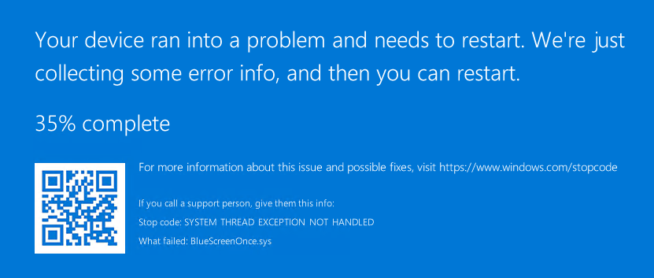

# Blue Screen Once

## Background
We in [Fuddata](https://www.linkedin.com/company/fuddata) have done a lot of research about that how we can build product(s) which would allow our customers to make their environments more secure and do that in way that it would no directly compete with any existing solution but support those in their important function.

As part of one of those researches we did go through [this](https://learn.microsoft.com/en-us/windows-hardware/drivers/dashboard/get-started-dashboard-submissions) process to be come Microsoft partner and to be able to publish Windows Certified drivers (WHQL).

## Why building Blue Screen Once?
On Friday, July 19, 2024 update to the CrowdStrike agent caused blue screen to a large number of computers in all over the world.

The question which many have been asking that that how this is possible?

Why it wasn't detected during testing? Either by CrowdStrike or by Microsoft on those mandatory driver certification tests.

Even when we don't have insides about CrowdStrike testing process we can investigate what can be found from public sources and test those with [Windows Hardware Lab Kit](https://learn.microsoft.com/en-us/windows-hardware/test/hlk/)

## What it does?
Even when we don't know for sure if it true, [this](https://x.com/perpetualmaniac/status/1814376668095754753) post in X suggest that CrowdStrike driver `CSAgent.sys` was trying to read invalid memory address `0x9c` which why Windows kills that driver and as always when kernel mode process is killed the result was blue screen. There was also [suggestion](https://x.com/jeremyphoward/status/1814364640127922499) that problematic channel file would be full of zeros but at least that part looks to be debunked by CrowdStrike in [this](https://www.crowdstrike.com/blog/falcon-update-for-windows-hosts-technical-details/) blog post.

Never the less, I found my self of thinking that would it be possible to build kernel mode driver which causes blue screen by trying to read `0x9c` and got it Microsoft certified? It definitely is you can see from [this](https://partner.microsoft.com/en-us/dashboard/hardware/Driver/DownloadCertificationReport/84654820/14292368797856219/1152921505698038994) certification report.

I found answer by realising that these Windows Hardware Lab Kit actually only test those parts of the code which are active at the time.
So I added simple check to code that it will not do anything Monday, July 22, 2024.

But why it is called for Blue Screen *Once*? Well, because nobody likes blue screens and even less boot loops caused by them so I set starting mode manual and only start driver in install script.

## But why reading memory address 0x9c causes blue screen?
Unlike on many more modern programming languages in C/C++ developer is responsible to do memory allocation, initialization and deallocation.
This is powerful because data does not need to be copied in memory when it is needed by different parts of code but instead of it can be referenced with pointer.

Downside of this however is that if developer does bad job by referencing parts of the memory addresses which aren't valid or properly initialized the result is crash of the application.
This is true for all C and C++ applications.

However, as kernel mode drivers run with same rights than Windows it selves it is not possible to crash only this problematic driver but instead of Windows don't have other choices than show the blue screen and save memory dump to the disk.

So even when it does not feel like that from end user's point of view, blue screen is actually Windows feature which purpose is prevent permanent damages to system and collect those memory dump which can be used to find root cause of the issue.

# How to learn from it?
Even if you are not C/C++ developer code in [Driver.c](Driver.c) is very simple to understand.

## Development
If you want to try build this driver, you would need:
* Two computers and preferably at least one of the should be virtual machine where you are able to take and revert snapshots.
  * First one is used for development and the virtual machine for testing.
* Visual Studio installed with "Workloads: Desktop development with C++" and "Individual components: MSCVC <version> C++ x64/x86 Spectre-mitigated libs (Latest), Windows SDK and Windows Driver Kit"

## Debug
Normally 3rd party drivers does not make [pdb files](https://learn.microsoft.com/en-us/visualstudio/debugger/specify-symbol-dot-pdb-and-source-files-in-the-visual-studio-debugger) public so you actually cannot see that which code line it crashed but here those are available.

However, you have three options:
1. Check result of crash dump analysis from [here](CrashDumpAnalysis.txt)
2. Download driver and ready made memory dump from releases and [analyze it](https://learn.microsoft.com/en-us/windows-hardware/drivers/debugger/crash-dump-files)
3. Actually install this driver to some computer, collect memory dump from it and analyze it.

# Installation
Be warned one more time, this driver **WILL CAUSE BLUE SCREEN** on you Windows. So do not use it on any critical system.

That been said. Here is installation guide:
1. Download [latest release](../../releases/tag/v12.8.52.827)
2. Extract zip file.
3. Right click over `install.cmd` and select "Run as Administrator".
4. See blue screen happening.

You can disable driver by running script `disable.cmd`

You can permanently uninstall by (please open issue/pull request if you know better way to this):
1. Open cmd with Run as Administrator.
2. Stop driver with command `sc stop BlueScreenOnce` (however, it should not be running unless you have moved date back to past).
3. Check with command `pnputil /enum-drivers` that which oemX number your driver got.
4. Uninstall driver file with command `pnputil /delete-driver oemX.inf`
5. Delete driver service with command `sc delete BlueScreenOnce`

# Conclusions
At least one thing which we can learn from this study is that Microsoft Certification is not that strong as you would expect.
Neither to prevent unstable drivers to be published or as security boundary.

However, because process to get in that point that company is able to get certification for their drivers is quite long and expensive it at least makes bad actors work harder.
